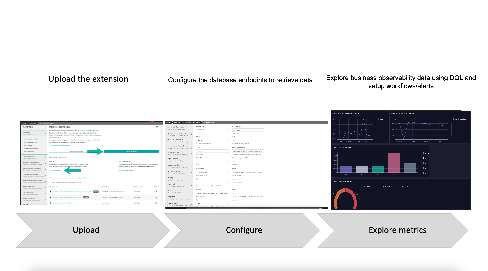
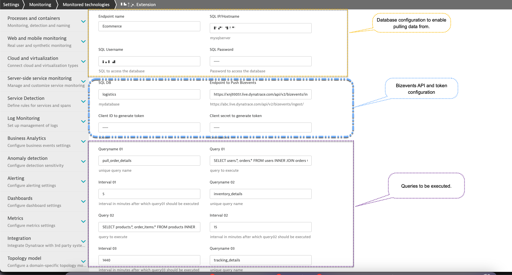

# BusinessObservability-DatabaseExtension  

A Dynatrace extension built leveraging [Dynatrace extension framework](https://www.dynatrace.com/support/help/shortlink/activegate-extensions-intro) to pull business observability data from database.  
  

# How does it work?  
End-user uploads the extension on an activeGate and configure the endpoint. Once configured, extension will retrieve the SQL data and the convert into business observability events. 
These events can be visualed using dashboards/DQL or create alerts/workflows using the events/metrics.  

# Extension installation and configuration 
1. Download the extension [ZIP file](https://github.com/nikhilgoenkatech/BusinessObservability-DatabaseExtension/blob/9fa7e4afedc2b1b7828054b31f643a6edccbcd57/custom.remote.python.sqlite3.zip). **Don't rename the file.**  
2. Unzip the ZIP file to the plugin_deployment (found at /opt/dynatrace/remotepluginmodule/plugin_deployment/) directory of your ActiveGate host.  
3. In the Dynatrace menu, go to **Settings > Monitored technologies > Custom extensions** and select **Upload Extension**.  
4. Upload the ZIP file.  
5. Once uploaded, unzip the zip file at the same location.  
6. Setup the following information to pull the business observability metrics from underlying database:  
   There are broadly three configuration sections as below   
   
   ### Database configuration  
      * Endpoint name: Any label to identify this connection. It is used for identification purposes.  
      * SQL IP/Hostname: The database IP or hostname.  
      * SQL Username: Username of the user who has permission to login on the SQL server remotely and access the database.  
      * SQL Password: Password for the username.  
      * SQL DB: The database name.  
  
   ### Bizevents API and token configuration  
      * Endpoint to Push Bizevents: Bizevents API that will push the database metrics.  
        ➡ Configure it similar to http://xyz.live.dynatrace.com/api/v2/bizevents/ingest  
          💡 replace xyz with tenant uuid  
                   
      * Client ID to generate token:  Client-id used to generate oauth token. To generate client-id, refer to documentation [here](https://www.dynatrace.com/support/help/shortlink/account-api-authentication)  
      * Client secret to generate token: Client secret for token generation.  

   ### SQL Queries   
      * Queryname 01: Unique name to identify that query to ensure data identification and retention within Dynatrace.  
      * Query 01: SQL query to retrieve data.  
      * Interval 01:  Frequency in minutes to execute the configured query.  
      
      💡 Add multiple queries (depending on the requirement) with the above config for each query.  

## 📉 Limitations  
* The extension is scheduled periodically 1 min and will run the query to collect data at the configured interval and will pull only the data that is available in the database table at that time. So, potentially can miss records in case of race condition.
* OAuth token is currently limited to keep alive time of only 5 minutes.
* Will result in potential data loss in case of DB timeouts.

⚠️ **Please note that this extension is not officially supported and is a Minimum Viable Product (MVP). Its purpose is to demonstrate how to utilize bizevents for extracting data from various sources or the underlying database**
